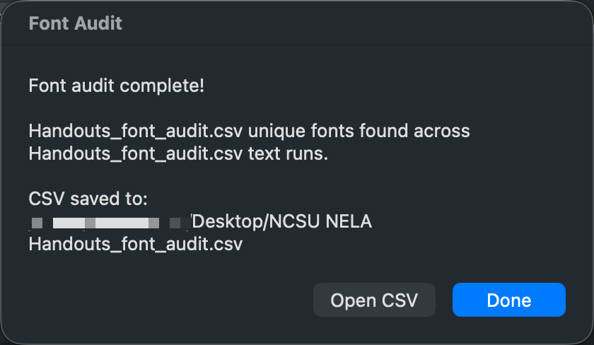

# Font Audit for PowerPoint

> Scan every text element in a `.pptx` file and get a detailed report of which fonts are used, where they appear, and how they're styled.


---

## The Problem

PowerPoint decks accumulate font inconsistencies over time — a copy-paste from a Mac brings in Helvetica, a template change leaves runs inheriting from an old theme, and suddenly your "brand-compliant" deck has five fonts. PowerPoint's built-in **Replace Fonts** dialog shows which fonts are referenced but not *where* they appear. Finding them manually means clicking through every shape on every slide.

## The Solution

Font Audit walks every text run in a `.pptx` file — including text inside tables, grouped shapes, and nested groups — and produces a report showing exactly:

- **Which font** is applied to each text run
- **Which slide** and **which shape** it's in
- **Font size**, **bold**, and **italic** state
- **The actual text** styled with that font
- Runs using **inherited/theme fonts** (flagged so you know what's hardcoded vs. theme-dependent)

Output is available as a **console report** (summary + slide-by-slide detail) and/or a **CSV** you can open in Excel for sorting and filtering.

## Screenshot



---

## Quick Start

### 1. Install Python 3

<details>
<summary><strong>macOS</strong></summary>

```bash
# Check if already installed
python3 --version

# If not, install via Homebrew
brew install python3

# No Homebrew? Install it first:
/bin/bash -c "$(curl -fsSL https://raw.githubusercontent.com/Homebrew/install/HEAD/install.sh)"
```
</details>

<details>
<summary><strong>Windows</strong></summary>

1. Download from [python.org/downloads](https://www.python.org/downloads/)
2. Run the installer — **check "Add Python to PATH"** on the first screen
3. Click Install Now
4. Verify: open Command Prompt and run `python --version`
</details>

<details>
<summary><strong>Linux</strong></summary>

```bash
# Debian/Ubuntu
sudo apt install python3 python3-pip

# Fedora/RHEL
sudo dnf install python3 python3-pip
```
</details>

### 2. Install the dependency

**Option A — Virtual environment (recommended for macOS with Homebrew):**

```bash
python3 -m venv ~/font-audit-env
source ~/font-audit-env/bin/activate
pip install python-pptx
```

**Option B — User install:**

```bash
pip3 install --user python-pptx
```

**Option C — Windows:**

```bash
pip install python-pptx
```

### 3. Clone this repo

```bash
git clone https://github.com/GoblinEater/PPTX-Font-Audit.git
cd PPTX-Font-Audit
```

### 4. Run it

```bash
python3 font_audit.py /path/to/presentation.pptx
```

With CSV export:

```bash
python3 font_audit.py /path/to/presentation.pptx --csv ~/Desktop/font_report.csv
```

---

## Desktop App (Drag and Drop)

Don't want to use the terminal every time? Build a native drag-and-drop app.

### macOS

The `mac/` folder contains an AppleScript-based builder that creates a proper macOS droplet — drag a `.pptx` onto the app icon and it runs the audit.

```bash
cd mac
chmod +x build_mac_app.sh
./build_mac_app.sh
```

This creates **Font Audit.app** on your Desktop. Drag `.pptx` files onto it or double-click to pick a file.

> **First launch:** macOS may block it as "unidentified developer." Right-click the app → Open → click Open. One-time only.

### Windows

The `windows/` folder contains `font_audit_app.pyw` — a GUI wrapper with file picker and save dialog.

1. Place `font_audit.py` and `font_audit_app.pyw` in the same folder
2. Right-click `font_audit_app.pyw` → Send to → Desktop (create shortcut)
3. Drag `.pptx` files onto the shortcut

The `.pyw` extension runs without showing a command prompt window.

---

## Reading the Output

### Console: Font Summary

Lists every unique font found in the file, ranked by number of text runs:

```
======================================================================
FONT SUMMARY
======================================================================
  Montserrat                            487 text runs
  (inherited/theme default)             552 text runs
  Consolas                               75 text runs
  +mn-lt                                 53 text runs
  Helvetica                               1 text runs

  Total text runs: 1168
  Unique fonts:    5
```

### Console: Detail by Slide

```
--- Slide 12 ---
  [Montserrat] (14.0pt, bold)
    Shape: Group 11 → Rectangle 3
    Text:  "Asset Identification Rules"
```

### CSV Columns

| Column   | Description |
|----------|-------------|
| `slide`  | Slide number |
| `shape`  | Shape name (includes group nesting path and table cell position) |
| `font`   | Font name, or `(inherited/theme default)` if not explicitly set |
| `size_pt`| Font size in points |
| `bold`   | `True` / `False` |
| `italic` | `True` / `False` |
| `text`   | The text fragment styled with that font |

### What the Findings Mean

| Finding | Explanation |
|---------|-------------|
| `(inherited/theme default)` | No font set on this run — it inherits from the slide master or theme. Works in your template but may shift if the file is opened with a different theme. |
| `+mn-lt` | PowerPoint's internal token for "minor Latin font from the theme." Same inheritance behavior. |
| Unexpected font name | Usually a copy-paste artifact. A lone Helvetica in a Montserrat deck means someone pasted from a Mac-originated source. |

---

## Project Structure

```
font-audit-pptx/
├── font_audit.py              # Core audit script (all platforms)
├── README.md                  # This file
├── LICENSE                    # MIT License
├── .gitignore                 # Python/macOS/Windows ignores
├── Font_Audit_Tool_Guide.docx # Printable setup guide for teams
├── mac/
│   ├── build_mac_app.sh       # One-time builder for macOS drag-and-drop app
│   └── FontAudit.applescript  # AppleScript droplet source
└── windows/
    └── font_audit_app.pyw     # Windows drag-and-drop GUI wrapper
```

---

## Limitations

- **Read-only by design.** The tool identifies font usage but does not modify anything. Mass font replacement in PowerPoint risks text overflow, broken layouts, and shifted elements — the recommended workflow is to identify issues with this tool, then make targeted manual fixes.
- **Theme font resolution.** Runs flagged as `(inherited/theme default)` or `+mn-lt` are using whatever the theme defines. The tool reports what's *explicitly set* at the run level. Use PowerPoint's Replace Fonts dialog to see which theme fonts are mapped.
- **SmartArt text** is not directly accessible via `python-pptx` and won't appear in the report.

---

## Contributing

Contributions welcome! Some ideas:

- [ ] Add speaker notes font auditing
- [ ] Add slide master/layout font auditing
- [ ] HTML report output with color-coded findings
- [ ] SmartArt text extraction (requires XML-level parsing)

Fork the repo, make your changes, and open a pull request.

---

## License

[MIT](LICENSE) — use it however you like.
